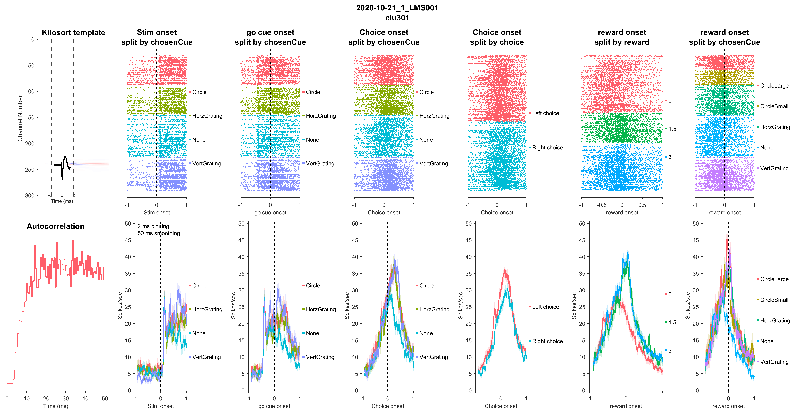
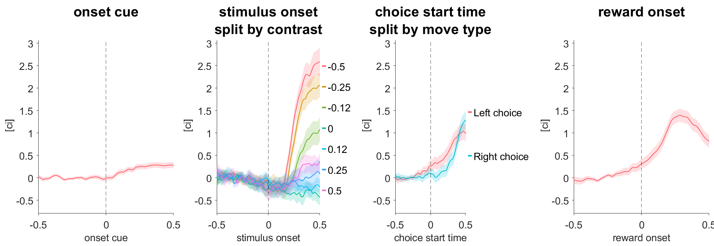
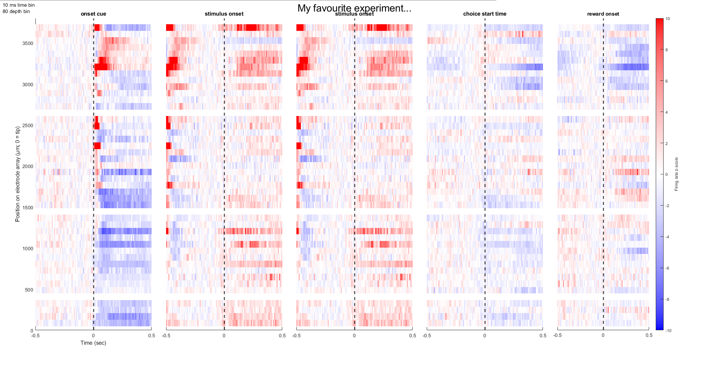

# easy-plot-neural #
MATLAB package for easy plotting of neural raster/psths, and event-aligned averages of an arbitrary continuous variable. 

Add the **+easy** folder to your MATLAB path and use the following functions listed below. See help documentation for each function. 

This toolbox requires that you've installed the spikes and [gramm](https://github.com/piermorel/gramm) and [spikes](https://github.com/cortex-lab/spikes) toolboxes.
  
  
  
## easy.RasterPSTH() ##
Allows plotting of spiking Raster and PSTHs for an individual neuron, aligned to multiple events of interest and separated for different conditions. Also permits sorting the rows of the raster plot by some other time variable, and configuration of PSTH binning and (causal) smoothing windows (see help text). Also displays the spiking autocorrelation and average waveform shape on the left, to verify that the recorded neuron is good quality.

## easy.EventAlignedAverage() ##
Shows event-aligned averages of any arbitrary continuous variable, with splitting for different conditions.

## easy.PSTHByDepth() ##
Shows event-aligned spiking activity across an entire electrophysiological probe.

